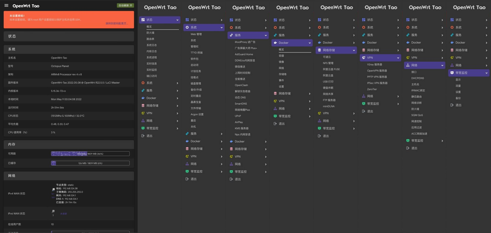
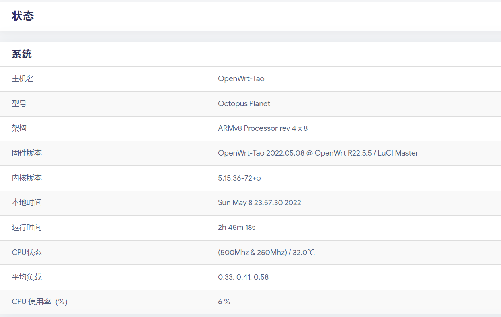
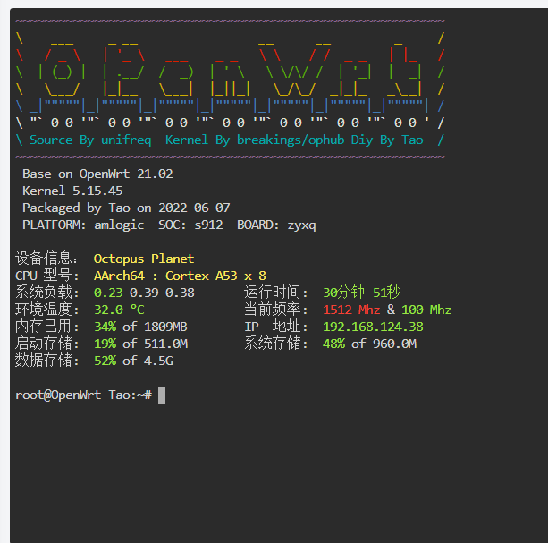
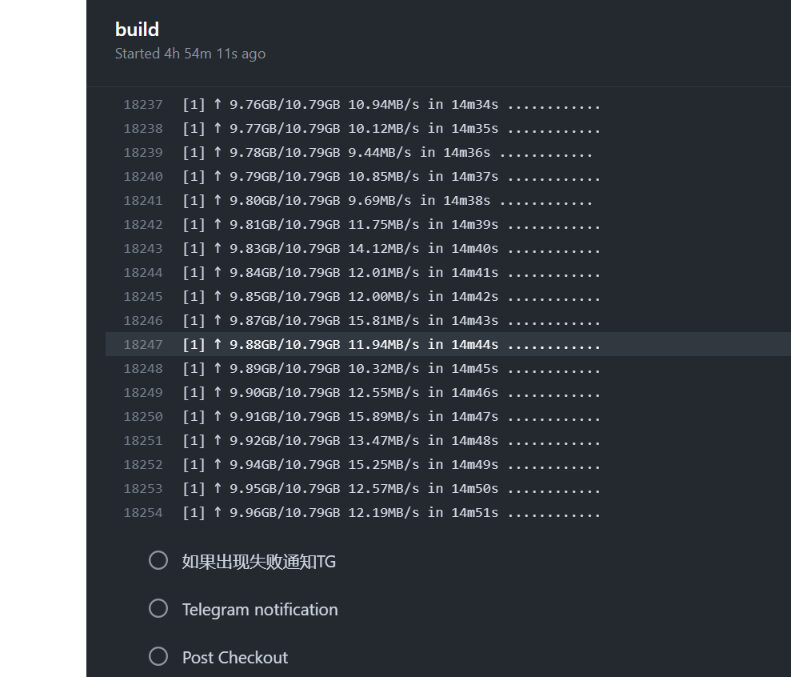
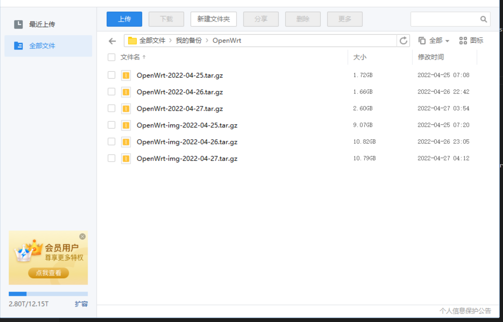

# Auto-Update-OpenWrt

#### 支持一键打包目前已经支持的全部 OpenWrt 固件，如贝壳云、我家云、微加云，以及 Amlogic S9xxx 系列型号如 s922x、s905x3、s905x2、s905d，s905，s912 等。
# 自动备份OP官方、L大、以及内核仓库到本仓库，修改打包脚本，添加自定义banner界面和内核信息，改用了自编译内核。包含大量个人文件和DIY内容，不适合第三方使用。
## 添加脚本自动同步整个仓库和系统文件到天翼云盘。
#### 采用zip压缩命令，压缩整个固件构建环境目录以及单独压缩所有镜像输出的目录，
#### 编译环境备份为OpenWrt-
#### 全部镜像备份为OpenWrt-img-并使用天翼云盘命令行工具上传至天翼云盘。
## 注意：每次压缩镜像大小看选择构建的镜像数目而定，本仓库构建F大全部固件，最后压缩之后仍然有12G左右。
## 如需要备份到天翼云盘，需要添加名为NAME和PASS的变量。

## To Do List

* [X] 实现多源码更新检测触发不同action。
* [X] 三位大佬源码编译。
* [ ] OpenWrt官方源码编译，依赖太多暂未完成。
* [X] 个人版删除源码自带的密码和banner，个人版修改登录前后的web各种小尾巴。
* [X] 自编译内核自动同步源码并编译，去除内核小尾巴。
* [X] 个人版去除概览页的肿瘤式cpu跑分信息，去除内核小尾巴。
* [X] 个人版取消发布到公共仓库。个人版自定义脚本加密，尊重源码维护者的工作，release里面的全部带有源码作者原链接。

## 所有软件插件图以及概览和ttyd界面。

效果图：

## 使用[unifreq/openwrt_packit](https://github.com/unifreq/openwrt_packit)脚本编译，添加diy内容。
### 目录解析 

| 目录                   | 作用                  | 说明                                            |
|------------------------|------------------------|------------------------------------------------|
| diy   | 自定义配置目录                     | banner network etc(docker) |
| BACKUP         | 备份目录 | lede、kernel、openwrt_packit、flippy-openwrt-actio、amlogic-s9xxx-openwrt、amlogic-s9xxx-armbian。。。 |

## 源码目录结构

## 鸣谢

- [OpenWrt/OpenWrt](https://github.com/openwrt/openwrt)
- [coolsnowwolf/lede](https://github.com/coolsnowwolf/lede)
- [unifreq/openwrt_packit](https://github.com/unifreq/openwrt_packit)
- [breakings/kernel](https://github.com/breakings/OpenWrt/tree/main/opt/kernel)
- [ophub/flippy-openwrt-actions](https://github.com/ophub/flippy-openwrt-actions)
- [haiibo/OpenWrt](https://github.com/haiibo/OpenWrt)
- [tickstep/cloudpan189-go](https://github.com/tickstep/cloudpan189-go)